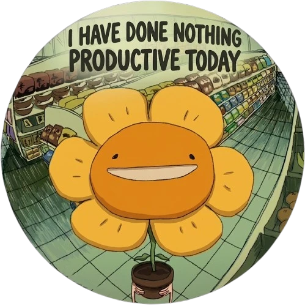

<!-- Dynamic Random Profile Banner -->

<!-- Retro Pixel Font (Press Start 2P) -->

<!-- Dynamic Random Tactical Quote -->

 
 

<!-- About Me Section -->

  

  

    <b>Aadish here</b> — creating random, mildly useless things that are way too fun to build anyway :)
  

  

    I like playing games, breaking things in the code editor, and seeing what happens when a random idea gets completely out of hand.
  

  

    Right now, I’m building <a href="https://github.com/AadishY/BugShot-Roulette" target="_blank"><b>Bugshot Roulette</b></a> 🎮 — bringing chaotic multiplayer showdowns directly into the browser.
  

  

    Most days involve debugging weird glitches that shouldn't exist, accidentally creating brand-new ones, and keeping way too many browser tabs open. When I’m not building, I’m usually gaming and convincing myself it counts as "product research".
  

  

    Feel free to poke around my repos, drop a star, or reach out if you want to swap game ideas and chat!
  

  

    
    &nbsp;
    
    &nbsp;&nbsp;
    
    &nbsp;&nbsp;
    
  

 
 

<!-- YouTube Music Widget (Dynamic Random on Refresh) -->

 

 

<!-- Commit Activity Contribution Graph (Bottom) -->

 
<picture>
  <source media="(prefers-color-scheme: dark)"
    srcset="https://raw.githubusercontent.com/AadishY/AadishY/output/pacman-contribution-graph-dark.svg">
  <source media="(prefers-color-scheme: light)"
    srcset="https://raw.githubusercontent.com/AadishY/AadishY/output/pacman-contribution-graph.svg">
  
</picture>
 

 
 <!-- Page Views -->
 

