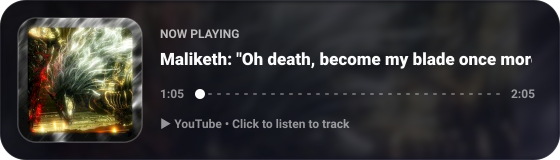

<!-- Random Profile Banner -->

<!-- Retro Pixel Font (Press Start 2P) -->

<!-- START_QUOTE -->

<!-- END_QUOTE -->
 
 

<!-- About Me Box (Pixel Font) -->

<!-- Aesthetic Contact Badges -->

  
  &nbsp;
  
  &nbsp;
  

<!-- GitHub Stats (Stealth Transparent Dark Theme) -->

  

<!-- YouTube Music Widget: Bayle the Dread (Elden Ring OST) -->

  

<!-- Page Views -->
 
<small><i>Page Views</i></small>

  

<!-- Commit Activity Contribution Graph (Bottom) -->

 
<picture>
  <source media="(prefers-color-scheme: dark)"
    srcset="https://raw.githubusercontent.com/AadishY/AadishY/output/pacman-contribution-graph-dark.svg">
  <source media="(prefers-color-scheme: light)"
    srcset="https://raw.githubusercontent.com/AadishY/AadishY/output/pacman-contribution-graph.svg">
  
</picture>

